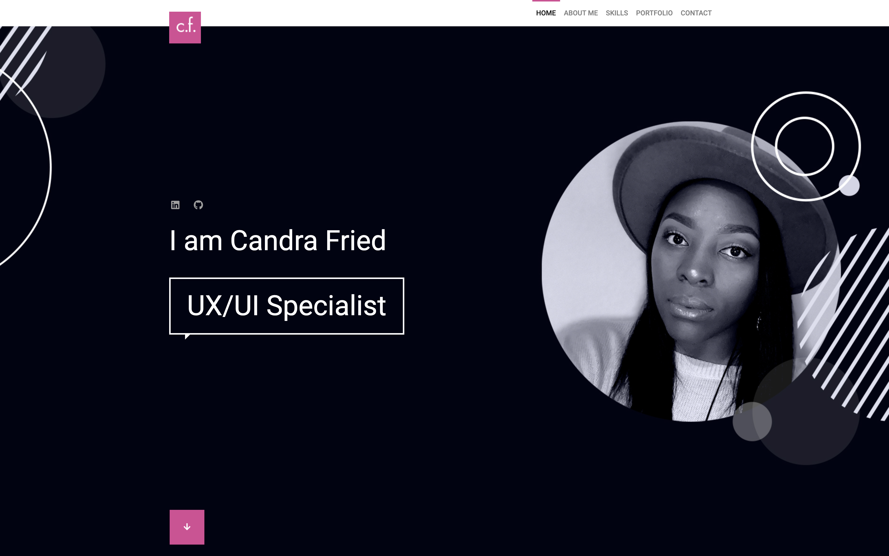
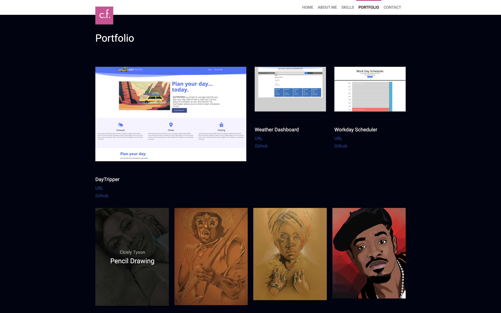

# Candra Fried Portfolio 2021
Welcome to the online portfolio for Candra Fried. This portfolio features some of the latest development and design work of the Dallas-based UX/UI specialist.

## Important & Relevent URLs

- [Deployed Application URL](https://candracodes.github.io/cfried-portfolio-2021/)
- [GitHub Repo URL](https://github.com/candracodes/cfried-portfolio-2021)
- [Resume](https://drive.google.com/file/d/1DQE7p5poFXvcVrIBnuNTejJkuoTIuxOj/view?usp=sharing)
- [LinkedIn](https://www.linkedin.com/in/candracook/ )


## Foreword

- This application aims to accomplish the following:
  - Display my contact information.
  - Have links to my GitHub profile and LinkedIn profile
  - Have a link to a downloadable PDF of my resume
  - Display at least 2 recent examples of my development work from deployed projects 
  - Each development project will contain the following:
    * Project title
    * Link to the deployed version
    * Link to the GitHub repository
    * Screenshot of the deployed application
    * Have a polished, mobile-responsive user interface.


## User Story

```
As a seasoned UX/UI Developer and recent Full Stack Developer
I WANT to have an online presence to showcase my work
SO THAT I can leave a lasting impression on future employers and those interested in working together
```

## Mock-Up

* This portfolio resembles the following screenshots:




## Frameworks & Libraries

The project is created using the following frameworks and libraries

- [Bootstrap v4.6](https://getbootstrap.com/docs/4.6/getting-started/introduction/)
- [FontAwesome — v5.8.1](https://fontawesome.com/v5.15/how-to-use/on-the-web/referencing-icons/basic-use)
- [jQuery — v3.2.1](https://api.jquery.com/)
- [Google Fonts - Open Sans](https://fonts.googleapis.com/css2?family=Open+Sans:ital,wght@0,300;0,400;0,600;0,700;1,300;1,400;1,600;1,700&display=swap)

## Licensing
The project is made possible with the following Licensing:
- [MIT & Envato Elements](license.txt)